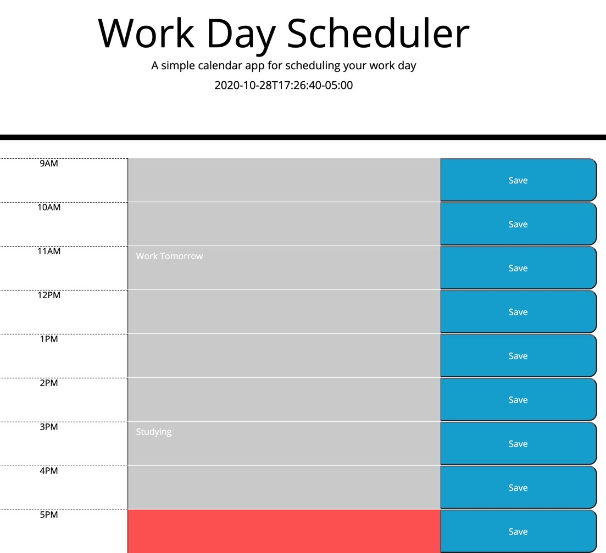

# Work_Day_Scheduler

# Description
This project's goal was to create a schedule calendar application that allows a user to save events for each hour of the day by modifying the starter code. This app will run in the browser and feature dynamically updated HTML and CSS powered by jQuery.
We used  Moment.js library to work with date and time. 

# Work Day Scheduler

# Installation
The installation I used is:
* Terminal
* Visual Studio Code
* GitHub
* GitLab
* Moment - https://momentjs.com/ 

# License

2020 Alice Piar All rights Reserved.

